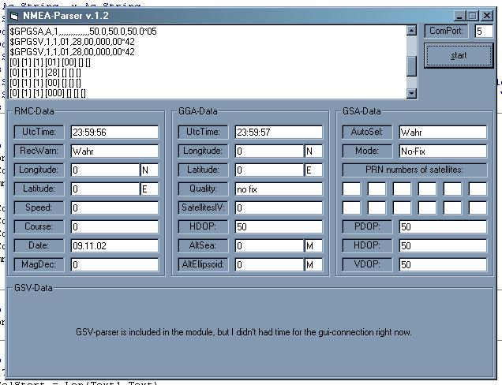



## NMEA GPS Parser v\.1\.2 for RMC, GGA, GSA, GSV datasentences

### Description

Connecting to a GPS-Receiver with MsComm control, this code will parse the datasentences RMC, GGA, GSA and GSV from a NMEA-Stream and show them in an adequate way. Compatibility functions (Round,Replace,Split) for VB5 are included. Comments and variablenames etc in english, used Option Explicit in Main-Module. Please vote if you like it and comment, if you have questions or constructive ideas. PS: This is the newer version, there is an older version that only parses RMC and GGA sentences.
 
### More Info
 

             |
---                |---
**Submitted On**   |2005-06-18 05:11:14
**By**             |[NexNo](https://github.com/Planet-Source-Code/PSCIndex/blob/master/ByAuthor/nexno.md)
**Level**          |Advanced
**User Rating**    |5.0 (10 globes from 2 users)
**Compatibility**  |VB 4\.0 \(32\-bit\), VB 5\.0, VB 6\.0
**Category**       |[Complete Applications](https://github.com/Planet-Source-Code/PSCIndex/blob/master/ByCategory/complete-applications__1-27.md)
**World**          |[Visual Basic](https://github.com/Planet-Source-Code/PSCIndex/blob/master/ByWorld/visual-basic.md)
**Archive File**   |[NMEA\_GPS\_P1945821132005\.zip](https://github.com/Planet-Source-Code/nexno-nmea-gps-parser-v-1-2-for-rmc-gga-gsa-gsv-datasentences__1-63143/archive/master.zip)

